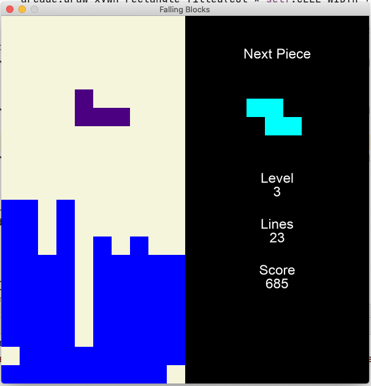

# FallingBlocks

A falling blocks game, made to serve as a demonstration of building a Tetris-like game in Python with the Arcade library.

## Built Using

- Python 3.8 (should work with 3.7 or newer)
- Arcade 2.4.1

## Screenshot

